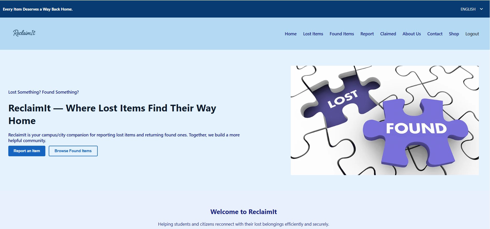
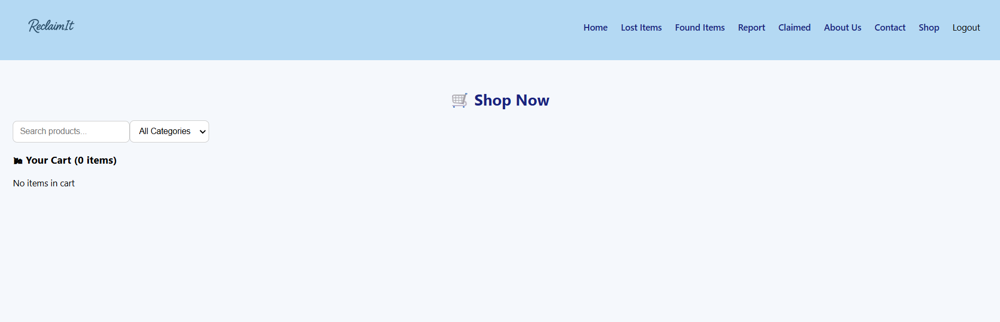
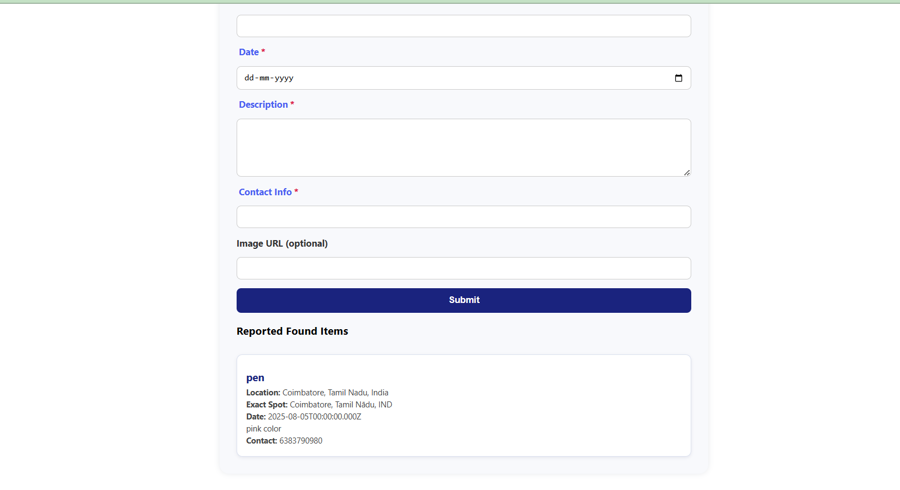

# 🛡️ ReclaimIt - Lost & Found Web App  

ReclaimIt is a **MERN Stack** based Lost & Found application that helps students and citizens post, search, and reclaim lost items. It also features a **Shop module** for items and a **Report section** for feedback and suggestions.  

---

## 🚀 Features
- 🔑 User Authentication (Sign Up, Login, Logout)  
- 📢 Post and claim lost items  
- 🛒 Shop Page with e-commerce like features  
- 📝 Report Page for queries & feedback    

---

## 📸 Project Screenshots  

### 🏠 Home Page
  
This is the **Home Page** where users can see the latest lost and found posts.  
Navigation links are provided for other modules like **LostItems** **FoundItems** **Claimed** **Shop** and **Report**.  

---

### 🛒 Shop Page
  
The **Shop Page** works like an e-commerce site, where users can browse and purchase items.  

---

### 🔑 Lost and found Items 
  
  
Users can upload the lost items and found items in a form like format and that will be verified and authenticated and displayed in claimed Pages if they match.
As a additional features of that in future has a plan of mailing the customers about the matches indicating **Your items are found**.

---

## 🛠️ Tech Stack  
- **Frontend:** React.js  
- **Backend:** Node.js, Express.js  
- **Database:** MongoDB  
- **Authentication:** JSON-based backend (custom)  

---

## 📂 Project Structure  
ReclaimIt/
├── backend/ # Node.js & Express backend
├── frontend/ # React frontend
├── OutputImages/ # Screenshots used in README
├── README.md # Project documentation
└── package.json

📌 Future Enhancements

--🔍 Advanced search & filtering
--📱 Mobile-friendly UI
--🔔 Email/Push notifications for matched lost items

👨‍💻 Author
Developed by Ramya V 👨‍💻
## Contact

If you want to get in touch, feel free to reach out!

- **Email:** 9750ramya@gmail.com
- **LinkedIn:** https://www.linkedin.com/in/ramya-v-0135a9257
